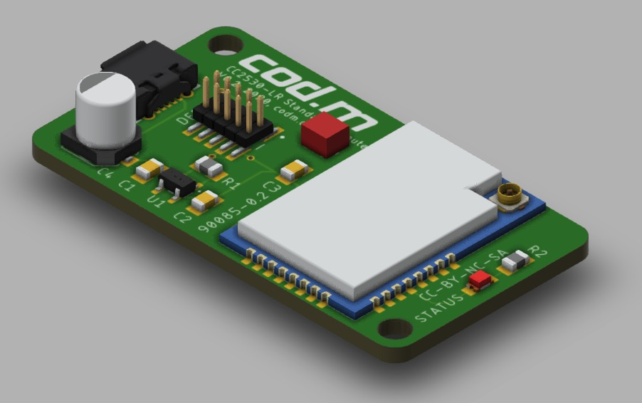
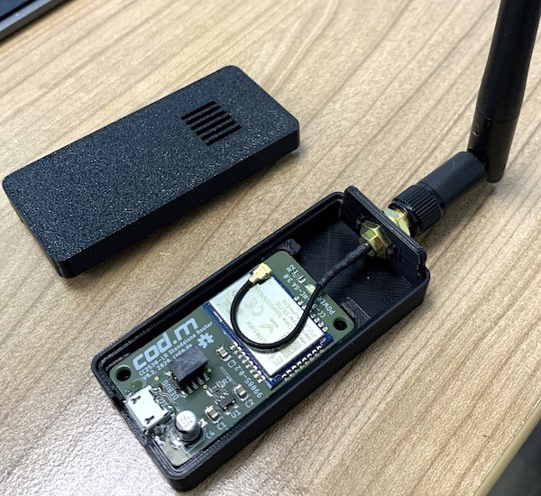

# cod.m CC2530+CC2592 Long Range ZigBee Router
Here are the Eagle board files and schematic of cod.m's [Zigbee Long Range Router](https://shop.codm.de/automation/zigbee/23/zigbee-cc2530-cc2592-long-range-router/repeater) based on EByte's E18-MS1PA1-IPX sporting an CC2530 combined with an CC2592 PA/LNA for range extension.

The corresponding eagle library for the EByte modules, including 3D models, can be found here: https://github.com/codm/eagle-libraries

You can buy a ready built router, including external antenna, 3D printed case and power supply at our webshop: [CC2530-CC2592 Long Range ZigBee Router](https://shop.codm.de/automation/zigbee/23/zigbee-cc2530-cc2592-long-range-router/repeater)

# Case
We also designed a neat 3D printed case. The design files are available on Thingiverse: https://www.thingiverse.com/thing:4192704

# Firmware
Thanks to https://ptvo.info and his [configurable ZigBee Firmware](https://ptvo.info/zigbee-switch-configurable-firmware-v2-210/), we've built our own version of the firmware - based on Z-Stack 1.2 - to make use of the onboard LED.

See zigbee2mqtt's FAQ for more info on how to use ZigBee routers and expand your current ZigBee mesh: https://www.zigbee2mqtt.io/information/FAQ.html#i-read-that-zigbee2mqtt-has-a-limit-of-20-devices-is-this-true

## Upgrading
You can flash the module with a another/new firmware using an CC-Debugger from TI, which is also used for the common CC2531-USB-Sticks. The pin header on the top has the same layout.

# License
[CC-BY-SA-NC 3.0](https://creativecommons.org/licenses/by-nc-sa/3.0/de/)

cod.m GmbH, Patrik Mayer, 2020
